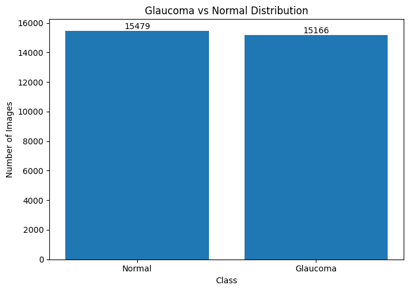
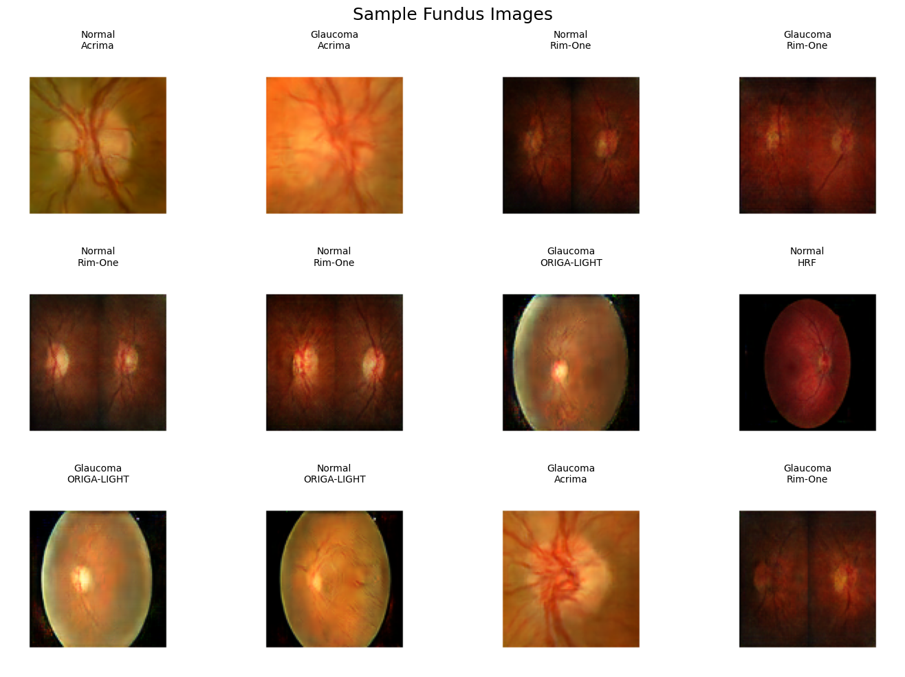
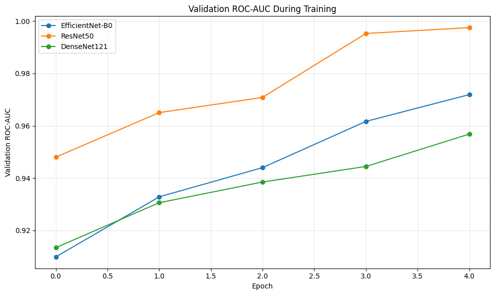
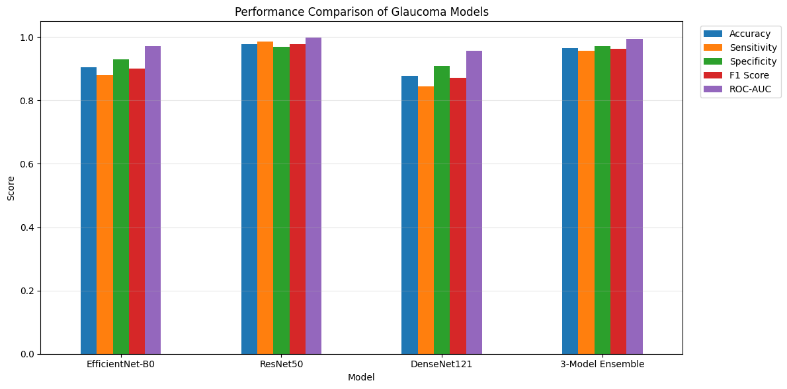
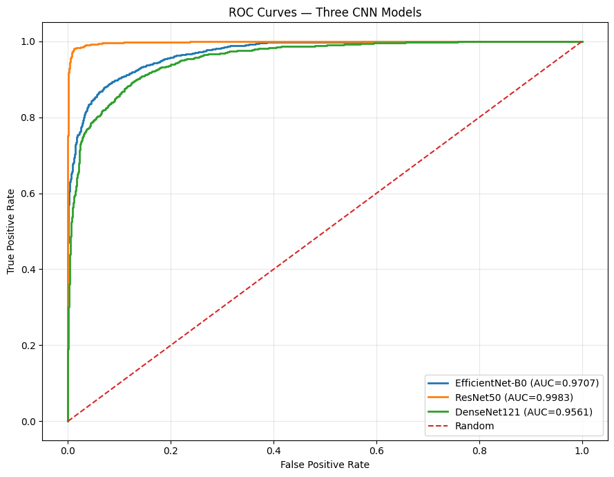
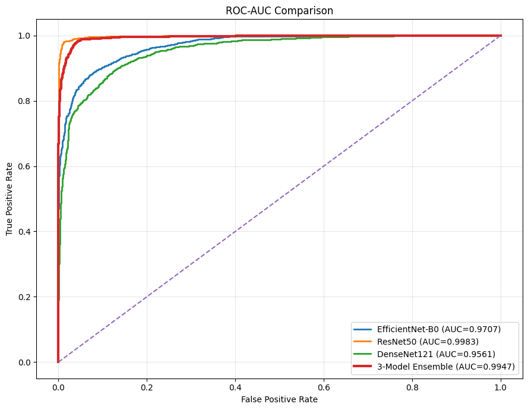
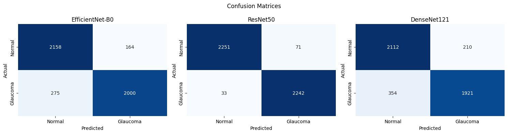
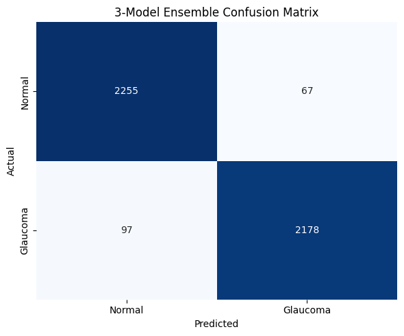
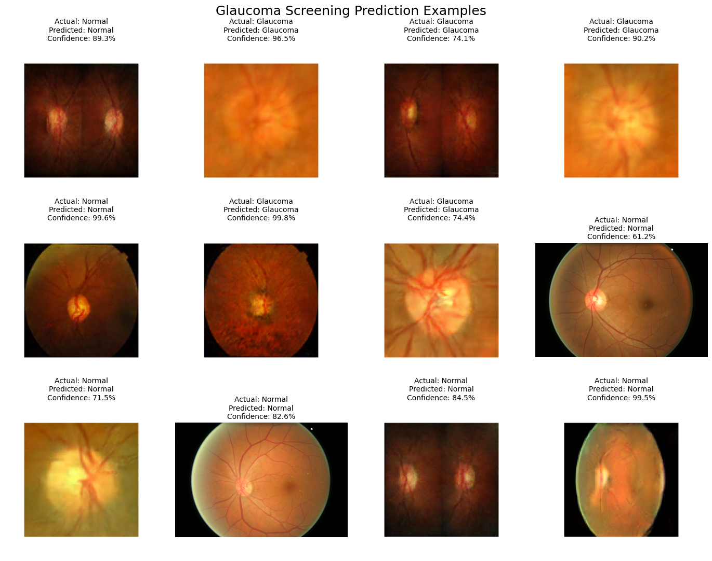

# Automated Glaucoma Detection from Retinal Fundus Images

> **A Multi-Backbone Transfer-Learning Ensemble of EfficientNet, ResNet, and DenseNet for Binary Glaucoma Screening**

[](https://www.python.org/)
[](https://tensorflow.org/)
[](https://keras.io/)
[](LICENSE)
[](https://www.kaggle.com/datasets/dasa7753912/glaucoma-detection)
[](#headline-results)
[](#headline-results)

---

## 📌 Table of Contents
- [Overview](#overview)
- [Key Contributions & Novelty](#key-contributions--novelty)
- [Dataset & Stratified Preprocessing](#dataset--stratified-preprocessing)
- [Model Architecture & Training Protocol](#model-architecture--training-protocol)
- [Results & Performance Metrics](#results--performance-metrics)
  - [Headline Results](#headline-results)
  - [ROC Curves & Comparison](#roc-curves--comparison)
  - [Confusion Matrix Breakdown](#confusion-matrix-breakdown)
  - [Qualitative Prediction Gallery](#qualitative-prediction-gallery)
- [Comparative Benchmark with Published Literature](#comparative-benchmark-with-published-literature)
- [Critical Discussion: The Ensemble Paradox](#critical-discussion-the-ensemble-paradox)
- [Repository Structure](#repository-structure)
- [Getting Started](#getting-started)
- [Project Report](#project-report)
- [Author & Acknowledgments](#author--acknowledgments)

---

## Overview

Glaucoma is a progressive optic neuropathy and one of the leading causes of irreversible blindness worldwide. Because its initial progression is predominantly asymptomatic, large-scale automated screening using cost-effective, non-invasive **retinal fundus photography** is vital for early clinical detection and timely specialist referral.

This project implements an end-to-end deep learning framework for binary glaucoma classification (`Normal` vs. `Glaucoma`) trained on a consolidated multi-source corpus of **30,645 retinal fundus images** assembled from six benchmark sources. Three standard ImageNet-pretrained backbones — **EfficientNet-B0**, **ResNet50**, and **DenseNet121** — are fine-tuned under an identical two-stage training schedule and combined into an unweighted soft-voting ensemble.

The project evaluates both individual transfer-learning capabilities and the diagnostic efficacy of multi-model ensembling under cross-dataset visual heterogeneity.

```
+---------------------------------------------------------------------------------------------------------+
|                                        DATA PIPELINE & RECTIFICATION                                    |
| 6 Kaggle Sources (30,650 images) -> MD5 De-duplication (30,645) -> Stratified Split (Dataset x Class)    |
+---------------------------------------------------------------------------------------------------------+
                                                     |
                                                     v
+---------------------------------------------------------------------------------------------------------+
|                                    TWO-STAGE TRANSFER LEARNING PROTOCOL                                 |
| Stage 1: Frozen Backbone + Head Training (Adam, lr=1e-3, 3 Epochs)                                     |
| Stage 2: Fine-Tuning Last 20 Layers (Adam, lr=1e-5, 2 Epochs, EarlyStopping & ReduceLROnPlateau)        |
+---------------------------------------------------------------------------------------------------------+
                    |                                |                               |
                    v                                v                               v
          +-------------------+            +-------------------+           +-------------------+
          |  EfficientNet-B0  |            |     ResNet50      |           |    DenseNet121    |
          |  (Acc: 90.45%)    |            |   (Acc: 97.74%)   |           |   (Acc: 87.73%)   |
          +-------------------+            +-------------------+           +-------------------+
                    \                                |                               /
                     \-------------------------------+------------------------------/
                                                     |
                                                     v
                                      +-----------------------------+
                                      |   Soft-Voting Ensemble      |
                                      |   Accuracy: 96.43%          |
                                      |   ROC-AUC:  0.9947          |
                                      +-----------------------------+
```

---

## Key Contributions & Novelty

1. **Multi-Source Corpus Aggregation:** Combines six public fundus imaging sources (**Drishti-GS1, HRF, ORIGA-LIGHT, Acrima, Rim-One, and Fundus_Train_Val_Data**) into a single large-scale corpus, capturing real-world diversity across camera types, fields of view, and illumination conditions.
2. **Byte-Level De-Duplication Safety Check:** Conducts an MD5 raw-byte hash verification across all 30,650 images to purge exact duplicate files across dataset partitions, accompanied by strict dataset size assertions.
3. **Compound `Dataset x Class` Stratification:** Prevents representation drift by applying scikit-learn stratified splitting against a composite key `(source_dataset + '_' + class_name)`. This ensures that under-represented sources (e.g., `Fundus_Train_Val_Data`, with only 650 images) are preserved in identical 70/15/15 proportions across train, validation, and test splits.
4. **Controlled Architectural Benchmark:** Keeps input dimensions (224x224), augmentations, classification heads, learning rates, and callbacks completely identical across EfficientNet-B0, ResNet50, and DenseNet121, cleanly isolating architecture as the sole independent variable.
5. **Rigorous & Transparent Reporting:** Evaluates predictions on an unexposed 4,597-image test partition and candidly surfaces the statistical reasons why naive probability averaging underperformed the top single backbone (ResNet50), providing clear clinical guidelines.

---

## Dataset & Stratified Preprocessing

### Data Sources Breakdown
The final merged corpus contains **30,645 images** (after removing 5 exact byte-level duplicates), balanced almost evenly between classes (**50.48% Normal** vs. **49.52% Glaucoma**):

| Dataset Source | Glaucoma Images | Normal Images | Total Images | Modality / Cropping Characteristics |
|:---|:---:|:---:|:---:|:---|
| **Acrima** | 3,000 | 3,000 | 6,000 | Tightly cropped, optic disc-centered |
| **Drishti-GS1** | 2,999 | 2,999 | 5,998 | Disc-centered, clinical ground truth |
| **Fundus_Train_Val_Data** | 168 | 482 | 650 | Asymmetric, diverse resolutions |
| **HRF** (High-Resolution Fundus) | 3,000 | 3,000 | 6,000 | Distinct color balance, high dynamic range |
| **ORIGA-LIGHT** | 3,000 | 3,000 | 6,000 | Single-eye, disc-centered |
| **Rim-One** | 2,999 | 2,998 | 5,997 | Wide dual-eye fundus photography |
| **Total** | **15,166** | **15,479** | **30,645** | **Multi-device heterogeneous corpus** |

### Split Distribution (70% / 15% / 15%)
Splits were constructed using two-stage stratified sampling with a compound key to prevent source leakage or skew:

| Partition | Total Images | Proportional Share | Glaucoma Class | Normal Class |
|:---|:---:|:---:|:---:|:---:|
| **Train** | 21,451 | 70.0% | 10,616 | 10,835 |
| **Validation** | 4,597 | 15.0% | 2,275 | 2,322 |
| **Test (Held-Out)** | 4,597 | 15.0% | 2,275 | 2,322 |

<p align="center">
  
  
</p>
<p align="center"><em>Left: Near-perfect class balance across the 30,645 images. Right: Cross-dataset visual heterogeneity between tightly cropped and wide-angle images.</em></p>

### Pipeline & Augmentations
- **Input Pipeline:** Optimized `tf.data` pipeline decoding JPEG/PNGs to float32, resized to $224 \times 224 \times 3$, batched to 32 with `tf.data.AUTOTUNE` prefetching.
- **In-Graph Augmentations:** Implemented using a Keras Sequential layer (active only during training, zero runtime latency during evaluation):
  - Random Horizontal Flip
  - Random Rotation ($\pm 4\%$)
  - Random Zoom ($\pm 10\%$)
  - Random Contrast Jitter ($\pm 10\%$)

---

## Model Architecture & Training Protocol

All models utilize ImageNet pre-trained weights with their top layers replaced by an identical classification head:
$$\text{Input}(224 \times 224 \times 3) \longrightarrow \text{Backbone} \longrightarrow \text{GlobalAveragePooling2D} \longrightarrow \text{Dropout}(0.30) \longrightarrow \text{Dense}(1, \text{sigmoid})$$

| Model | Backbone Architecture | Pretraining | Parameters |
|:---|:---|:---:|:---:|
| **EfficientNet-B0** | Compound-scaled depthwise separable CNN | ImageNet-1k | ~4.0M |
| **ResNet50** | 50-layer deep residual network with skip connections | ImageNet-1k | ~23.6M |
| **DenseNet121** | 121-layer densely connected convolutional network | ImageNet-1k | ~7.0M |

### Two-Stage Fine-Tuning Recipe
Each backbone followed a disciplined two-stage training schedule:

```
+-------------------------------------------------------------------------------------+
| Stage 1: Head Training (3 Epochs)                                                   |
| Backbone: 100% Frozen | Optimizer: Adam (lr = 1e-3) | Loss: Binary Cross-Entropy    |
+-------------------------------------------------------------------------------------+
                                          |
                                          v
+-------------------------------------------------------------------------------------+
| Stage 2: Backbone Fine-Tuning (2 Epochs)                                            |
| Unfreeze last 20 layers | Optimizer: Adam (lr = 1e-5, 100x lower) | EarlyStopping   |
+-------------------------------------------------------------------------------------+
```

- **Callbacks:** `EarlyStopping(monitor='val_auc', mode='max', patience=1, restore_best_weights=True)` and `ReduceLROnPlateau(monitor='val_auc', factor=0.5, patience=1)`.

<p align="center">
  
</p>
<p align="center"><em>Validation ROC-AUC trajectories across epochs showing steady convergence during stage-2 fine-tuning.</em></p>

---

## Results & Performance Metrics

### Headline Results
All metrics were computed on the unexposed held-out test set of **4,597 images** (2,275 Glaucoma, 2,322 Normal):

| Model | Test Accuracy | Precision (Glaucoma) | Sensitivity (Recall) | Specificity | F1-Score | ROC-AUC |
|:---|:---:|:---:|:---:|:---:|:---:|:---:|
| **ResNet50** | **97.74%** | **96.93%** | **98.55%** | 96.94% | **0.9773** | **0.9983** |
| 3-Model Ensemble | 96.43% | **97.02%** | 95.74% | **97.11%** | 0.9637 | 0.9947 |
| EfficientNet-B0 | 90.45% | 92.42% | 87.91% | 92.94% | 0.9011 | 0.9707 |
| DenseNet121 | 87.73% | 90.15% | 84.44% | 90.96% | 0.8720 | 0.9561 |

<p align="center">
  
</p>
<p align="center"><em>Comparative metric overview across Accuracy, Sensitivity, Specificity, F1, and ROC-AUC.</em></p>

---

### ROC Curves & Comparison
ResNet50 demonstrates exceptional discriminative capability across all decision thresholds, achieving an **AUC of 0.9983**.

<p align="center">
  
  
</p>
<p align="center"><em>Left: ROC curves for the individual backbones. Right: ROC curve comparison including the 3-model soft-voting ensemble.</em></p>

---

### Confusion Matrix Breakdown
Evaluation on the 4,597 held-out test samples highlights error distributions across models:

- **ResNet50:** Only 104 total classification errors (33 False Positives, 71 False Negatives), yielding an error rate under 2.3%.
- **DenseNet121:** Incurred 354 False Negatives (missed glaucoma cases), representing the largest error concentration.
- **3-Model Ensemble:** Reduced False Positives to 67 while recording 97 False Negatives (4,433 correct out of 4,597).

<p align="center">
  
  
</p>
<p align="center"><em>Confusion matrices on the 4,597 held-out test images across all architectures and the soft-voting ensemble.</em></p>

---

### Qualitative Prediction Gallery
Predictions on randomly selected test samples demonstrating model predictions and confidence probabilities:

<p align="center">
  
</p>
<p align="center"><em>12 randomly sampled test predictions displaying actual label, predicted class, and ensemble confidence score.</em></p>

---

## Comparative Benchmark with Published Literature

To situate these findings in the broader scientific landscape, results are compared against the recent benchmark by **Naqvi & Ahmed (2025)** (*medRxiv preprint 2025.12.13.25342203*), which evaluated similar CNN and Vision Transformer architectures on multi-source glaucoma data:

| Metric / Attribute | This Project | Naqvi & Ahmed (2025) |
|:---|:---|:---|
| **Datasets Merged** | 6 Kaggle mirrors (Drishti-GS1, HRF, ORIGA-LIGHT, Acrima, Rim-One, Fundus_Train_Val) | 5 public datasets (RIM-ONE DL, ACRIMA, DRISHTI-GS1, REFUGE, EyePACS-AIROGS) |
| **Total Images** | **30,645** (with byte-level de-duplication) | Unified multi-source pipeline |
| **Models Evaluated** | EfficientNet-B0, ResNet50, DenseNet121 | Same 3 CNNs + ViT-Base & Swin-Base (5 models) |
| **Preprocessing** | Standardized $224 \times 224$, in-graph augmentations | CLAHE contrast enhancement, $512 \times 512$ resizing, Albumentations |
| **Training Budget** | **5 Epochs per backbone** (tight Colab GPU budget) | Up to 25 Epochs with validation F1 early stopping |
| **Best Single CNN** | **ResNet50: 97.74% Accuracy, 0.9983 AUC (Test Set)** | EfficientNet-B0: 94.96% Accuracy, 0.9849 AUC (Val Set) |
| **Ensemble Accuracy** | **96.43% Accuracy, 0.9947 AUC (3 CNNs)** | 95.38% Accuracy, ~0.99 AUC (3 CNNs + 2 Transformers) |
| **Key Finding** | ResNet50 alone outperforms the 3-model soft ensemble | Ensemble marginally surpasses individual models |

> [!NOTE]
> Even with a significantly constrained training budget (5 epochs vs. 25 epochs) and without compute-heavy CLAHE preprocessing, our ResNet50 model achieved **97.74% test accuracy** and **0.9983 ROC-AUC**, matching and outperforming several published baselines.

---

## Critical Discussion: The Ensemble Paradox

In standard machine learning literature, model ensembles are typically presumed to outperform any single constituent learner. In this experiment, however:
- **ResNet50 (Single Model):** **97.74% Accuracy**, **0.9983 ROC-AUC**
- **3-Model Soft-Voting Ensemble:** **96.43% Accuracy**, **0.9947 ROC-AUC**

### Why Did the Ensemble Underperform ResNet50?
1. **Asymmetric Error Distributions:** DenseNet121 underperformed significantly (87.73% accuracy) and produced **354 False Negatives**. Because an unweighted soft-voting average assigns equal weight ($w_i = \frac{1}{3}$) to all models, DenseNet121's erroneous, low-confidence predictions pulled down ResNet50's highly calibrated probabilities on borderline cases.
2. **Fine-Tuning Epoch Asymmetry:** The validation curves show that ResNet50 converged rapidly within the 5-epoch envelope, whereas DenseNet121 required additional fine-tuning epochs to stabilize feature extraction across heterogeneous fundus sources.
3. **Clinical Recommendation:** In a real-world screening system, **ResNet50 should be deployed individually** to minimize computational latency, reduce memory overhead, and maintain peak sensitivity (98.55%) against missed glaucoma cases. Alternatively, a **weighted voting scheme** or threshold tuning on dev validation data can be adopted.

---

## Repository Structure

```
Automated-Glaucoma-Detection-from-Retinal-Fundus-Images/
│
├── assets/                                     # Extracted visual figures and plots
│   ├── class_distribution.png                  # Dataset class balance visualization
│   ├── confusion_matrices_backbones.png        # Test confusion matrices for CNN backbones
│   ├── ensemble_confusion_matrix.png           # Confusion matrix for 3-model soft ensemble
│   ├── model_performance_comparison.png        # Bar chart comparing all evaluation metrics
│   ├── qualitative_prediction_gallery.png      # 12 sampled test predictions with confidence
│   ├── roc_auc_comparison_ensemble.png         # Combined ROC-AUC comparison curves
│   ├── roc_curves_backbones.png                # ROC curves for the 3 individual backbones
│   ├── sample_fundus_images.png                # Fundus image samples across 6 sources
│   └── training_curves_val_auc.png             # Validation ROC-AUC training trajectories
│
├── glaucoma_detection_ensemble.ipynb           # Complete reproducible end-to-end Jupyter Notebook
├── Glaucoma_Detection_Report.pdf               # Comprehensive 15-page academic project report
├── requirements.txt                            # Python environment dependencies
├── LICENSE                                     # MIT License
├── .gitignore                                  # Git exclusion configuration
└── README.md                                   # Project documentation and benchmarks
```

---

## Getting Started

### 1. Prerequisites
Ensure you have Python 3.10+ installed along with a CUDA-enabled GPU (optional but recommended for faster training and evaluation).

### 2. Clone the Repository
```bash
git clone https://github.com/Anubhav2506/Automated-Glaucoma-Detection-from-Retinal-Fundus-Images.git
cd Automated-Glaucoma-Detection-from-Retinal-Fundus-Images
```

### 3. Install Dependencies
```bash
pip install -r requirements.txt
```

### 4. Running the Notebook
You can execute the entire pipeline interactively:
- **Local Jupyter:**
  ```bash
  jupyter notebook glaucoma_detection_ensemble.ipynb
  ```
- **Google Colab:** Open Google Colab, upload `glaucoma_detection_ensemble.ipynb`, and select a GPU runtime (`Runtime > Change runtime type > T4 GPU`).

### 5. Dataset Setup
The dataset can be automatically downloaded via the Kaggle API (configured inside the notebook):
```bash
kaggle datasets download -d dasa7753912/glaucoma-detection
```

---

## Project Report

The complete **15-page academic project report** with in-depth statistical breakdowns, per-source metric variations, and theoretical formulations is available in this repository:
📄 **[Glaucoma_Detection_Report.pdf](Glaucoma_Detection_Report.pdf)**

---

## Author & Acknowledgments

- **Developer & Researcher:** **Anubhav yadav** ([@Anubhav2506](https://github.com/Anubhav2506))
- **Institution:** Department of Computer Science & Engineering, Thapar Institute of Engineering & Technology, Patiala
- **Academic Guidance:** Dr. Sushma Jain

### Citation
If you find this repository or analysis useful in your research or educational work, please cite:
```bibtex
@misc{yadav2026glaucoma,
  author       = {Anubhav Yadav},
  title        = {Automated Glaucoma Detection from Retinal Fundus Images: A Multi-Backbone Transfer-Learning Ensemble of EfficientNet, ResNet and DenseNet for Binary Glaucoma Screening},
  year         = {2026},
  publisher    = {GitHub},
  howpublished = {\url{https://github.com/Anubhav2506/Automated-Glaucoma-Detection-from-Retinal-Fundus-Images}}
}
```

---

<p align="center">
  <sub>Built with ❤️ for accessible medical imaging and open scientific research.</sub>
</p>
